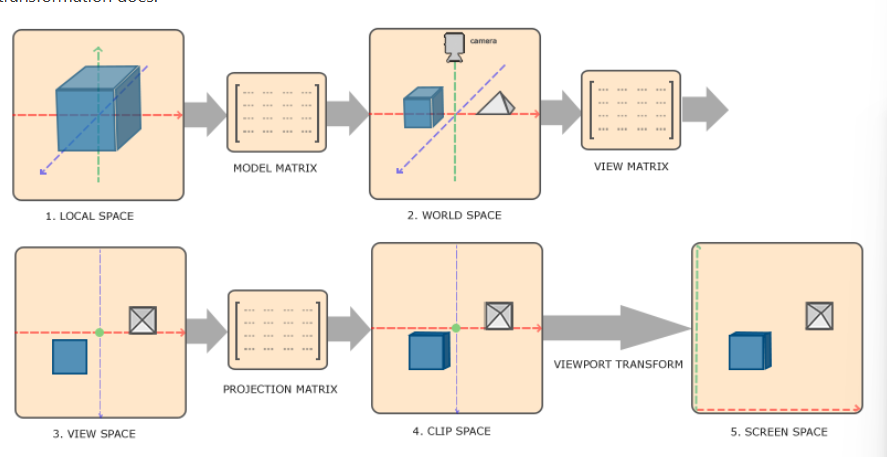

# Coordinate System
Como openGL esperar que todos los vértices que queremos visibilizar se encuentren en NDC (Normalized Device Coordinates), cada coordenada de vertex debe estar entre -1.0 y 1.0. Lo que se hace normalmente es especificar las coordenadas en un rango configurado por nosotros mismos y en el shader vertex transformarlos a NDC.

Transformar coordenadas a NDC y luego a coordenadas en pantalla es logrado de una manera metódica, donde transformamos los vertices de un objeto en muchos sistemas de coordenadas antes de transformalos en coordenadas en pantalla. La ventaja de transformar en tantos sistemas de coordenadas interemedios es que ciertas operaciones son más fáciles en ciertos sistemas de coordenadas. Hay 5 diferentes sistemas de coordenadas que son importantes para nosotros: 

1. Local space (también llamado Object space): Son las coordenadas de tu objeto relativas a su origen local. Son las coordenadas donde el objeto empieza.
2. World space: Estas son las coordenadas relativas al origen de coordenadas global. 
3. View space (también llamado Eye space): Cada coordenada es vista desde una cámara o punto de vista del observador.
4. Clip space: Son las coordenadas procesadas en el rango de -1.0 a 1.0 para determinar cuales vertices se verán en pantalla 
5. Screen space: Se procesa la información con un viewport transform que transforma las coordenadas de clip space al rango definido por GL.Viewport. Las coordenadas resultantes son enviadas a rasterizar y luego se conviernten en fragmentos. 

Estos 5 serás los diferentes estados en los que los vertices serán transformados antes de terminar siendo fragmentos (fragments)

## En general...
Para transformar las coordenada de un espacio al siguiente, se usarán muchas matrices de transformación de las cuales las más importantes son el modela, la vista y la de proyección (model, view, projection). Las coordenadas del los vertices empiezan en local space, son procesadas a world space, view coordinates, Clip space y finalmente en screen coordinates. Como se ve en la imagen a continuación:
