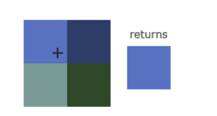
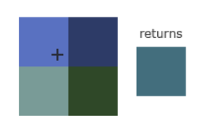

# TEXTURAS
Las texturas siempre varían sus coordenadas ente (0,0) a (1,1) y si se pasa sale de este rango, el comportamiento por defecto de openGL es repetir la imagen de la textura
pero hay más opciones: 
- Repeat: El comportamiento por defecto.
- Mirrored Repeat: Lo mismo que el repeat pero con un mirror (espejo) 
- ClampToEdge: Fijas las coordenadas entre 0-1 que para mayores coordenadas resulta en un patrón dentro del rago, estirado. 
- ClampToBorder: Las coordenadas que queden fuera del rango so dadas por un color de borde definido por el usuario.

# Uso 
Las opcíones anteriormente mensionadas pueden ser asignadas por eje coordenada (s, t, --p if estás usando 3D textures--) <equivalente a x,y,z> con la función GL.TexParameter:

```
GL.TexParameter(TextureTarget.Texture2D, TextureParameterName.TextureWrapS, (int)TextureWrapMode.Repeat);
GL.TexParameter(TextureTarget.Texture2D, TextureParameterName.TextureWrapT, (int)TextureWrapMode.Repeat);
```

# FILTRANDO TEXTURAS
Las coordenada de la textura no depende de la resolución, pero puede ser cualquier float. Así, OpenGL sabe cuál pixel de textura (conocido como texel) debe mapear la coordenada.
Esto es muy importante si se tiene un oobjeto muy grande con una textura de muy baja resolución.

## Filtering by nearest
Es el modo de filtro por defecto de OPENGL, selecciona el pixel que es más cerca al centro de la coordenada de la textura. 



## Linear Filtering

Toma un valor interpolado de los texels vecinos. Entre más pequeña es la difstancia del centro del texel de la coordenada de la textura, menos aporta a la interpolación. 




El resultado es que el nearest se ve más pixelado mientras que el lineal produce un patrón más suave y realista. Ya se escoge según las preferencias.

# Aplicación

Se puede usar tanto para maximizar o minimizar un objeto, y como recomendación se podría usar nearest cuando las texturas son minimizadas y linear cuando las esturcturas son maximizadas.

```
GL.TexParameter(TextureTarget.Texture2D, TextureParameterName.TextureMinFilter, (int)TextureMinFilter.Nearest);
GL.TexParameter(TextureTarget.Texture2D, TextureParameterName.TextureMagFilter, (int)TextureMagFilter.Linear);

```

# MIPMAPS
Imagina que tenemos un gran cuarto con miles de objetos, cada uno atado a una textura. Van a haber objetos lejos que tendrán la misma resolución que los más cercanos a la vista. Como los objetos lejanos pueden producir fragmentos pequeños, OpenGL tiene dificultades
devolviendo su color para su fragmento. Para resolver esto, OpenGL usa mipmaps que son básicamente una colección de texturas donde cada tecxtura subsecuente, es el doble de pequeña a la previa. Entonces, despuésde cierto umbral de distancia desde el viewer, openGl
usará una diferente textiura de mipmap que mejor quede según la distancia del objeto. Así que se debe crear la colección de los mipmaps.

Se pueden crear así: 
1. Llamar la función GL.GenerateMipmap(GenerateMipmapTarget.Texture2D)

Cuando se cambia entre mipmaps durante el rendering, opengl puede mostrar ciertos artefactos como ejes puntudos visibles entre dos campas de mimmap. Entonces, se puede filtrar igual que en las texturas con nearest y linear. 

- NearestMipmapNearest: Toma el mipmap más cercano para coincidir el tamaño del pixel.
- LinearMipmapNearest:  Toma el mipmap mas cercano y usa interpolación lineal.
- NearesyMipmapLinear: Interpola linealmente entre mipmaps que tienen tamaños muy iguales y luego ejecuta Nearest.
- LinearMipmapLinear: Interpoa entre los dos mipmaps más cercanos y luego hace linear interpolation. 

estos métodos se pueden usar de la siguiente forma: 
```
GL.TexParameter(TextureTarget.Texture2D, TextureParameterName.TextureMinFilter, (int)TextureMinFilter.LinearMipmapLinear);
GL.TexParameter(TextureTarget.Texture2D, TextureParameterName.TextureMagFilter, (int)TextureMagFilter.Linear);
```